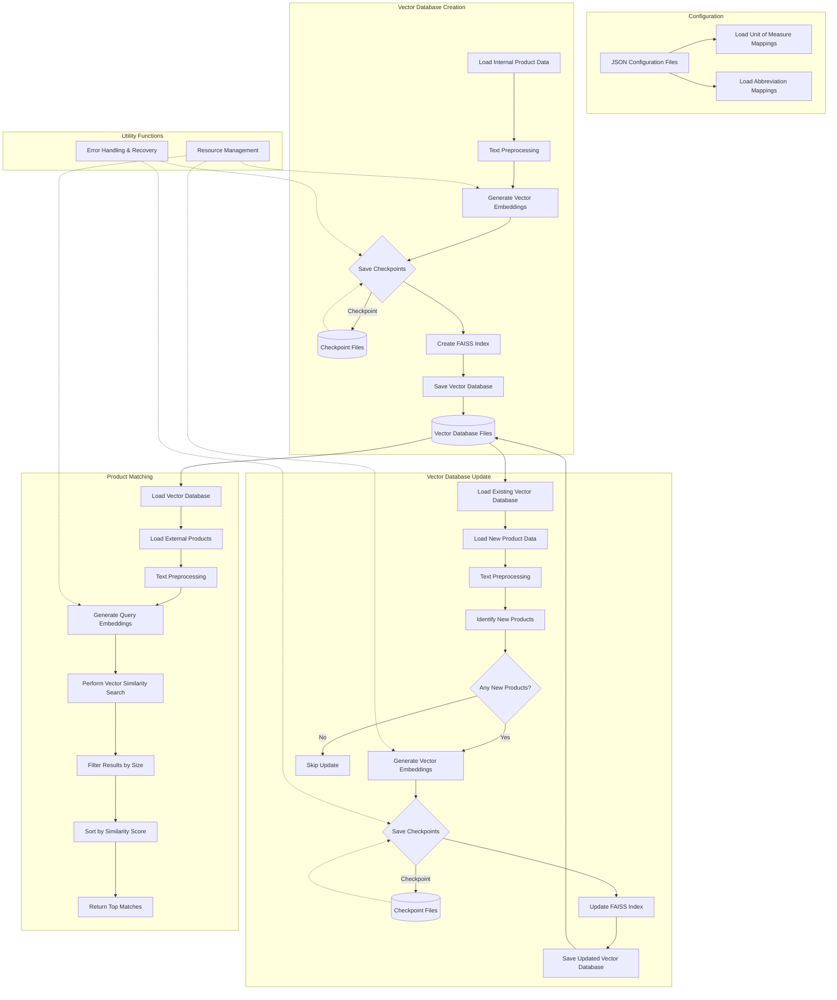

# Textual Product Mapping using RAG and LLM

This is an intelligent, automated system to match external products (varying product descriptions from suppliers) with internal items (inventory SKU product descriptions). The internal and external product description texts are acquired from separate CSV files.

A key criterion for matching is that it should be exact, meaning the product manufacturer, name, and size must be identical.

## Solution Architecture Flowchart



## Core Features of the Solution

### 1. Vector Embedding + LLM Matching

This solution uses a two-step process for better accuracy:

- **Step 1:** Vector similarity search to find the most semantically similar product candidates
- **Step 2:** LLM verification to determine exact matches based on precise criteria

### 2. Memory-Efficient Implementation

- Data processing is done in small batches to reduce memory usage for vector embeddings and for product matching
- Garbage collection is forced between processing steps
- Checkpoint-based processing makes it safer to resume processing in case of failure saving computational resources and time.

### 3. Size-Based Filtering

To improve matching accuracy from the LLM, candidates retrieved from vector search are filtered based on size similarity. In other words, only size-filtered candidates are sent to the LLM for final verification.

## Project Directory Structure:

```bash
project_root/
│
├── config/ # Configuration data in JSON format
│ ├── __init__.py
│ ├── uom_mappings.json
│ └── abbr_mappings.json
│
├── core/ # Core functionality modules
│ ├── __init__.py
│ ├── vector_db_module.py
│ ├── product_matcher.py
│ └── vector_db_updater.py
│
├── data/ # Data files
│ ├── external.csv
│ ├── internal.csv
│ └── internal_new.csv
│
├── db/ # Vector database
│ ├── vector.index
│ └── vector.pkl
│
├── out/ # Output mapping file
│ └── output.csv
│
├── utils/ # Shared utility functions
│ ├── __init__.py
│ ├── config_loader.py
│ └── text_processing.py
│
├── main.py # Script for product mapping
├── create_vector_db.py # Script for creating vector database
├── update_vector_db.py # Script for updating vector database
├── requirements.txt # Package dependencies
└── .env # Environment file containing `OPENAI_API_KEY`
```
